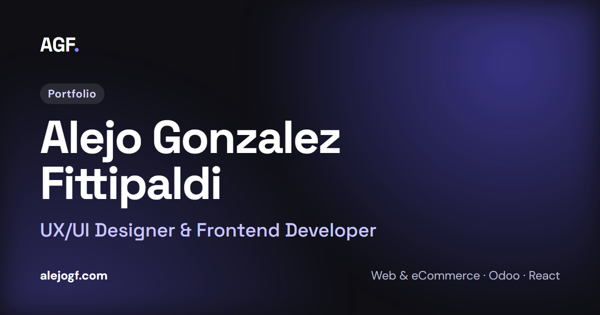

# alejogf.com

Portfolio personal de **Alejo Gonzalez Fittipaldi**, UX/UI Designer & Frontend Developer. Muestra mi experiencia, formación y habilidades, e incluye mi CV en español e inglés.

🔗 **[alejogf.com](https://alejogf.com)**



## Características

- Español e inglés, con cambio de idioma sin recargar la página.
- Modo claro y oscuro (respeta la preferencia del sistema y recuerda la elección).
- Diseño responsive, pensado primero para mobile.
- Página de CV (`/cv`) con formato de hoja A4: se puede leer en el navegador, imprimir en una sola hoja o descargar en PDF, en el idioma activo.
- Contacto directo por mail y WhatsApp, sin formularios.
- Animaciones sutiles al hacer scroll, que se desactivan si el sistema tiene "reducir movimiento".

## Stack

- [React 19](https://react.dev) + [Vite](https://vite.dev)
- [React Router](https://reactrouter.com)
- [Lucide](https://lucide.dev) para los íconos
- CSS plano con variables (design tokens), un archivo por componente
- [oxlint](https://oxc.rs) como linter

Los textos en dos idiomas y el tema claro/oscuro están hechos con Context de React, sin librerías extra.

## Correr el proyecto

Necesitás Node.js 20.19 o superior.

```bash
npm install
npm run dev       # http://localhost:5173
```

Otros comandos:

```bash
npm run build     # build de producción en dist/
npm run preview   # sirve el build localmente
npm run lint      # revisa el código
```

## Estructura

```
public/           favicon, fuentes, CV y headers del servidor
src/
  components/     header, footer, toggles de tema e idioma
  sections/       secciones de la home (Hero, Sobre mí, Experiencia...)
  pages/          Home, CV y 404
  data/           contenido: experiencia, educación, habilidades, contacto y CV
  i18n/           textos en español (es.json) e inglés (en.json)
  context/        estado del tema y del idioma
  hooks/          useTheme, useTranslation, useActiveSection
  styles/         tokens, estilos globales y fuentes
```

## Decisiones de diseño

- Diseño hecho a partir de referencias de portfolios y adaptado a mi identidad con un design system: tokens de colores, tipografía, espaciado y sombras en `src/styles/tokens.css`.
- Un solo violeta de marca (`#5a52e0`) en los dos temas, elegido para cumplir el contraste con texto blanco.
- Tipografías Space Grotesk (títulos) y DM Sans (texto), servidas desde el propio sitio.
- Animaciones con CSS (incluidas las de aparición al hacer scroll), sin librerías.

## Accesibilidad

- HTML semántico, navegación completa con teclado y link para saltar al contenido.
- Contraste mínimo de 4.5:1 en los textos, en los dos temas.
- Áreas táctiles de 44 px en botones y links.
- Respeta `prefers-reduced-motion`.

## Seguridad

El sitio es 100% estático. Se publica con headers de seguridad (Content Security Policy estricta, HSTS, `X-Frame-Options`, etc.) definidos en `public/_headers`. Las fuentes y los íconos se sirven desde el propio sitio, sin CDNs externos.

## Deploy

Sitio estático publicado en Cloudflare. Cada push a `main` genera un nuevo deploy.

## Créditos

- Tipografías [Space Grotesk](https://fonts.google.com/specimen/Space+Grotesk) y [DM Sans](https://fonts.google.com/specimen/DM+Sans) (SIL Open Font License).
- Logos de tecnologías de [Simple Icons](https://simpleicons.org) (CC0) y [Devicon](https://devicon.dev) (MIT).

## Licencia

El código se puede consultar como referencia. Los textos, el CV, las imágenes y los logos son personales o de sus respectivos dueños y no se pueden reutilizar.

---

Diseñado y desarrollado por **Alejo Gonzalez Fittipaldi** · [LinkedIn](https://www.linkedin.com/in/alejogf/) · [Behance](https://www.behance.net/AlejoGF)
